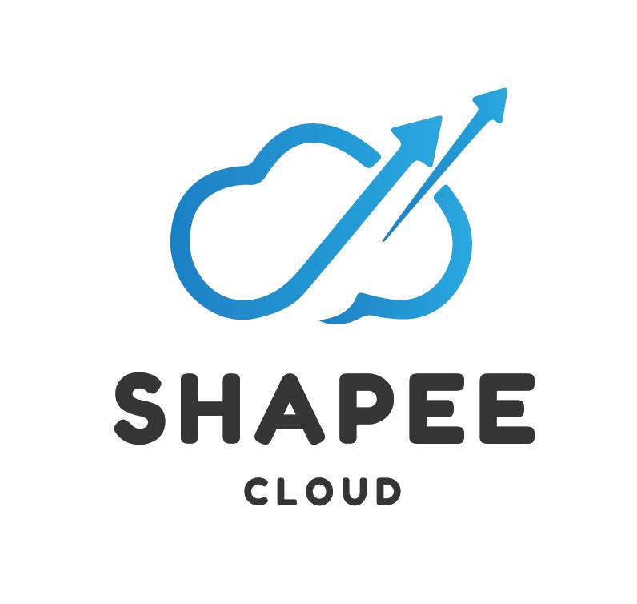

### Hi there 👋!

#### Who I am?
- My original name is **Hoang Trong Kien**
<!--- A mobile engineer based in **[Da Nang](https://en.wikipedia.org/wiki/Da_Nang), [Vietnam](https://en.wikipedia.org/wiki/Vietnam).** -->
- Have 3 years of hands-on experience in **iOS application development.**
- Developed products for **live streaming, e-commerce, financial service** and **trade stocks** business domains.
- Have built **native** apps targeting **iOS platform** ecosystems in **MVP, MVVM and VIPER** architectures.

#### What I'm doing?
<!--- 🏢 Working at **[Spartan Dev](https://spartan-dev.io/)** as a **Software Engineer**.-->
- 👨‍💻 Writing `Swift` `Objective-C`, `Kotlin`.
<!--- 🌍 Mostly active on .-->
- 📚 Currently learning about **Professional Scrum Master (PSM1)**, **RxSwift**, **MVVM-C**, and **Unit Test**.
- 👯 Looking to collaborate on **iOS projects**.
<!--- 🥰 Building **[Portrait Camera](https://github.com/kien-hoang/portrait_camera_effect)**, **[MVP-R](https://github.com/kien-hoang/TMDB-Movies-MVP-R)**, **[VIP](https://github.com/kien-hoang/TMDB-Movies-VIP)** & **[Vietnamese Blogs](https://viblo.asia/u/htkien99)** as pet projects.-->

#### What I like to discuss? 
- 💬 Ask me about `rxswift` `unit test` `TDD` `BDD` `architecture patterns` `design patterns` `system design` `scalability` `data structures` `clean code` and `choice of frameworks`.

#### What my skill set looks like?
- 🖥 **iOS:** 
  - **📜 Languages:** • `🧙🏻 Swift` • `👨‍🏭 Objective-C`
  - **🔬 Frameworks:** • [Alamofile](https://github.com/Alamofire/Alamofire) • [Moya](https://github.com/Moya/Moya) • [Kingfisher](https://github.com/onevcat/Kingfisher) • [SnapKit](https://github.com/SnapKit/SnapKit) • [SwiftUI](https://developer.apple.com/xcode/swiftui/)
  - **🗳 UI toolkits:** • [Figma](https://www.figma.com/) • [Draw.io](https://draw.io/)
- 🎡 **Software development ecosystem:**
  - **📁 Code repository:** • [Git](https://git-scm.com/) • [BitBucket](https://bitbucket.org/product) • [Sourcetree](https://www.sourcetreeapp.com/)
  - **🗃 Project management:** • [Jira Scrum Boards](https://www.atlassian.com/software/jira/features/scrum-boards) • [Google Sheet](https://www.google.com/intl/en/sheets/about/) • [Notion](https://www.notion.so/)
  - **🗂 CI/CD:** • [Fastlane](https://fastlane.tools/)• [Github Actions](https://github.com/features/actions) • [Github Pages](https://pages.github.com/) • [App Center](https://appcenter.ms/) 
- 🧙‍♂️ **Coding pattern & principles:**
  - **⚒ Patterns:**  • [Singleton](https://en.wikipedia.org/wiki/Singleton_pattern) • [Builder](https://en.wikipedia.org/wiki/Builder_pattern) • [Observer](https://en.wikipedia.org/wiki/Observer_pattern) • [Strategy](https://en.wikipedia.org/wiki/Strategy_pattern)
  - **⚒ Architectures:** • [MVC](https://en.wikipedia.org/wiki/Model%E2%80%93view%E2%80%93controller) • [MVVM](https://en.wikipedia.org/wiki/Model%E2%80%93view%E2%80%93viewmodel) • [MVP](https://en.wikipedia.org/wiki/Model%E2%80%93view%E2%80%93presenter) • [Clean Architecture](https://en.wikipedia.org/wiki/Robert_C._Martin)
  - **🗜 Principles:** • [DRY](https://en.wikipedia.org/wiki/Don%27t_repeat_yourself) • [SOLID](https://www.digitalocean.com/community/conceptual_articles/s-o-l-i-d-the-first-five-principles-of-object-oriented-design)
  
- **🏗️ Code editors:**
  
  
#### What's interesting about me?  
  - 😎 I am an **introvert** and I can speak **english** well.
  - 🧐 I love to be very **precise** and **thorough**. I hate **procrastinating**.
  - ✍️ I write about **why a certain code is written instead of what** in the comments.
  - ⏱️ I'm a **workaholic** and drink a lot of ☕ **coffee**.
  - 😅 I just can't **resist the urge** to **explore** a new **tech** released in the **Apple** ecosystem.

<!--Github Stats-->

 

<!--
#### What companies have I worked for?

  
  
  
   

#### What are my recent highlights?
- [featured-blurring-background-on-camera-like-iphone-native-camera](https://github.com/kien-hoang/portrait_camera_effect)
- [model-view-presenter-router-architecture](https://github.com/kien-hoang/TMDB-Movies-MVP-R)

#### How can you contact me for work?
- Email: **htkien.dev@gmail.com**
- Linkedin: **https://www.linkedin.com/in/kien-ht/**
-->
---
- Visitor Count: 
